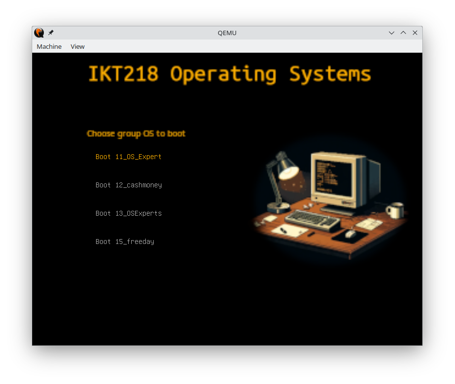

  

___

This repository represents a collection of tools and scripts that is able to download all forks of the IKT218 repository.
Each fork is then compiled and written to a floppy disk with a custom GRUB2 configuration and theme. 

This allows the user to boot the diskette on any x86 compatible machine with a 3.5" floppy drive. 

It is recommended to have at least 72MB of RAM, due to the memory needed by GRUB2 to keep e.g. graphics in memory. The extra memory is also needed as binaries are
compressed and need to be decompressed before they can be booted. 
A more lightweight version without graphics, which would require less memory, is planned.

  

